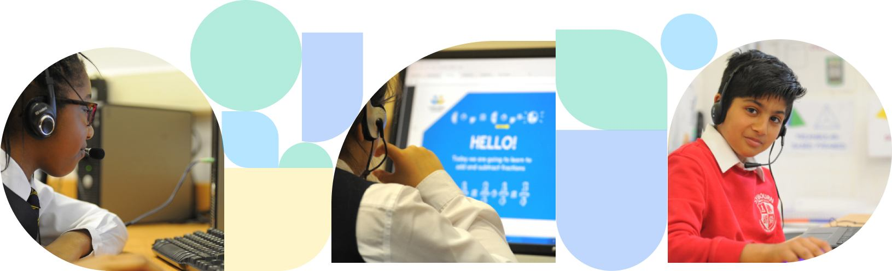

# Every Child is Worthy of Achieving Success!

By focusing on each student’s _dynamic approach_ to learning, I guarentee that a greater **passion** for education in and out of the classroom will rise! 

Therefore, my mission is to confidently ensure every boy and girl aquires the _knowledge_ to reach **academic excellence**! 

# What Makes Me Different Than Other Tutors?
Amongst those with a fierce ambition to unleash scholastic victory, I am a trained specailist in managing those with _Special Needs_, hence it is my top priority that a *welcoming and friendly environment* is created in order to to fulfill their potential - treating everyone equally with **kindness, patience and grace**.

# My Aims:

>
* To teach the skills involved in advancing intellectual performance. 
* To Offer supportive feedback on progress towards goals. 
* To give professional advice for individuals studying SATs to A-Levels.
* To make sure 100% of my students pass first time around, consistently assessing areas of improvement when working through test questions. 

# So... What Are You Waiting For?

Book a Session with Me [Here](https://www.gumtree.com/tuition-lessons)

Contact me on [Instagram](https://www.instagram.com/), [Outlook](https://outlook.office.com/mail/), [FaceBook](https://www.facebook.com/profile.php?id=100009205633066)


```
Did You Know?
Last Year, I helped my pupils achieve:
- a 12% increase in SATs scores, 
- 43% increase in GCSE results 
- 45% increase in A Level results
```

<iframe width="560" height="315" src="https://www.youtube.com/embed/DpSmR85RXVI" title="YouTube video player" frameborder="0" allow="accelerometer; autoplay; clipboard-write; encrypted-media; gyroscope; picture-in-picture" allowfullscreen></iframe>
